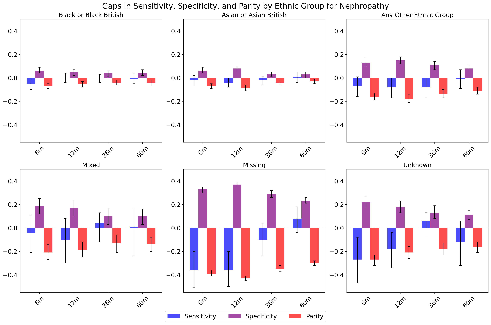

# NeurIPS fairness-complications
This repository contains the code for the workshop paper _Exploring Fairness in Long-Term Prediction of Type 2 Diabetes Microvascular Complications_ presented at the '24 NeurIPS workshop [AIM-FM: Advancements In Medical Foundation Models: Explainability, Robustness, Security, and Beyond](https://aim-fm-24.github.io/NeurIPS/)

## What is the challenge?
Foundation models are increasingly being used and applied to a variety of data sources, including structured electronic healthcare records (EHR) for disease risk prediction. It is currently not clear how these may be perpetuating existing biases known in the data or how this may vary over time.

## What did we do?
In this paper we leveraged large scale EHR data to explore the performance of pre-trained clinical language models on disease prediction tasks over different time windows. We predicted the risk of microvascular complications (nephropathy, neuropathy and retinopathy) in individuals living with Type 2 Diabetes over 6-, 12-, 36- and 60-month risk prediction windows and measured differences across sensitivity, specificity and demographic parity. 

## What did we find?
We demonstrated that models have statistically significant gaps in performance across different demographic groups, such as ethnic group, sex and level of deprivation. The performance gaps were particularly pronounced for ethnic minority groups, and those with missing or unknown ethnicity status. There was also indications that ethnic group bias may decrease over time, with longer prediction windows, such 36- or 60-months showing fewer statistically significant gaps than shorter time windows. 

*Gaps in performance on sensitivity, specificity and demographic parity on nephropathy task*

